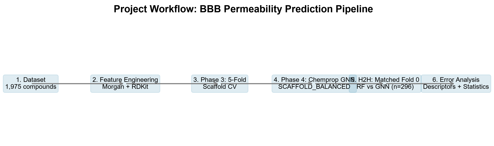
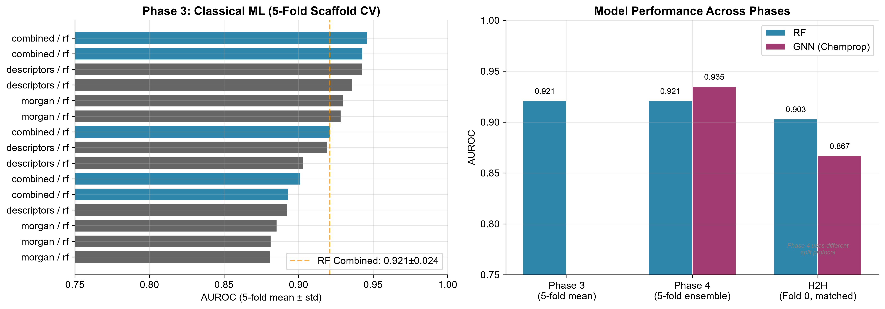
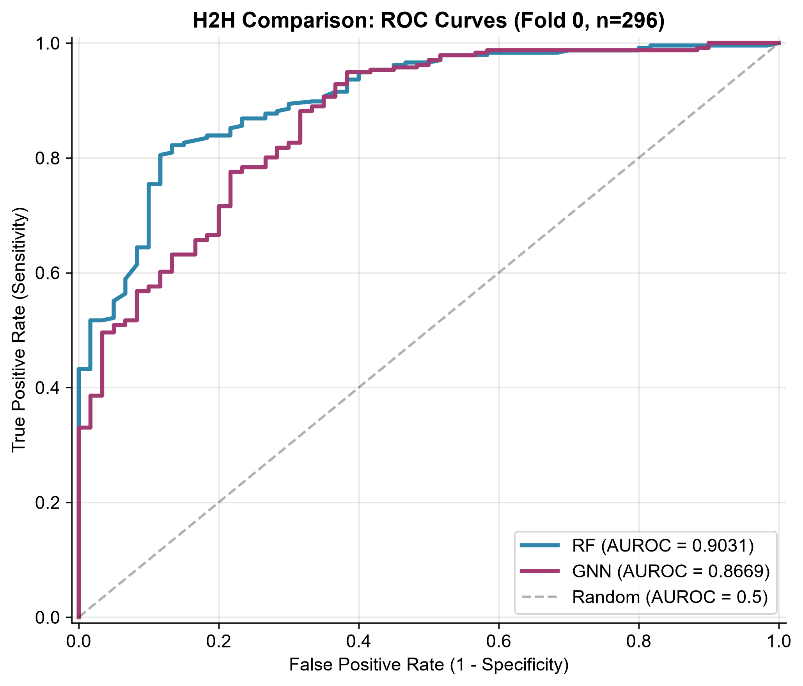
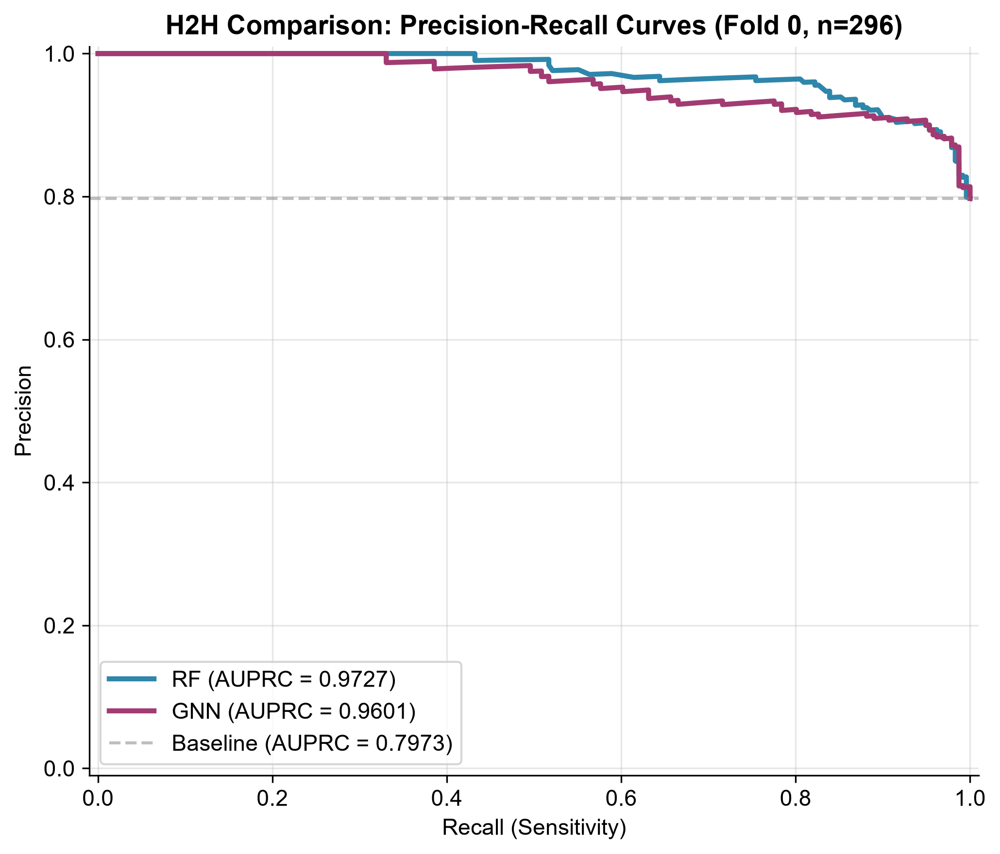
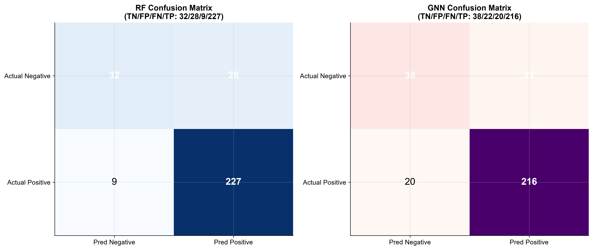
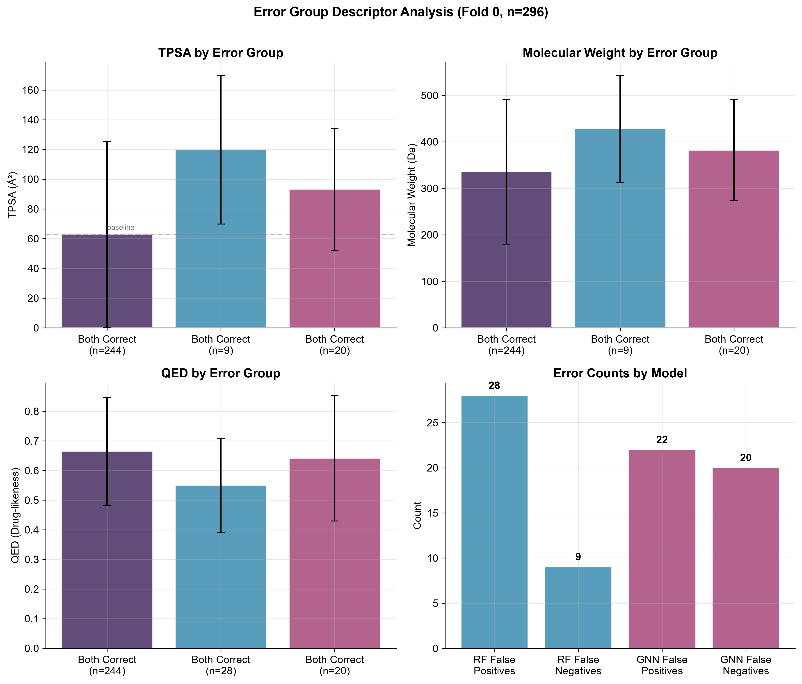

# AI-Based Blood–Brain Barrier Permeability Prediction

> Exploring how machine learning can help predict whether drug molecules are likely to cross the blood–brain barrier.

---

## Why This Project?

The **blood-brain barrier (BBB)** is a highly selective barrier of endothelial cells that protects the brain from most circulating drugs and toxins. For central nervous system (CNS) drugs — treatments for depression, Alzheimer's, Parkinson's, brain tumors, and epilepsy — crossing the BBB is an absolute requirement for efficacy.

Yet predicting BBB permeability is difficult. Experimental testing (in vitro assays, in vivo mouse models) is expensive, time-consuming, and ethically costly. A computational predictor that can flag likely permeable vs. non-permeable compounds early in drug discovery would help focus resources on the most promising candidates.

**This project investigates:** Can machine learning models trained on molecular structure reliably predict BBB permeability? And when they fail, what chemical patterns emerge?

---

## What I Built

A computational pipeline comparing two approaches to BBB permeability prediction:

```
Drug molecule (SMILES)
        │
        ├──► Molecular fingerprints + physicochemical descriptors ──► Random Forest
        │
        └──► Molecular graph (atoms as nodes, bonds as edges) ──► Chemprop Graph Neural Network
```

Both models predict whether a compound crosses the BBB (binary classification).

After initial evaluation, I conducted a **matched head-to-head experiment**: both models evaluated on the exact same test set of 296 compounds, followed by a chemical error analysis to understand *why* each model fails.



---

## Dataset

| Property | Value |
|---|---|
| **Source** | TDC BBB_Martins / MoleculeNet BBBP |
| **Compounds** | 1,975 |
| **Task** | Binary classification (permeable vs. non-permeable) |
| **Class balance** | 1,501 permeable (76%) / 474 non-permeable (24%) |
| **Representation** | Drug SMILES strings |
| **Verification** | 0 duplicate SMILES, 0 invalid SMILES, 0 duplicate rows |

The dataset was audited for data quality — no duplicate compounds, no invalid molecular structures, no duplicate rows.

---

## Models

### Random Forest

Represents each molecule using two molecular feature types:

- **Morgan fingerprints** (2,048-bit circular fingerprints capturing local substructure patterns)
- **RDKit descriptors** (185 calculated physicochemical properties including molecular weight, LogP, TPSA, hydrogen bond donors/acceptors, aromatic ring counts, and QED)

Feature sets: Morgan only, RDKit descriptors only, or Combined (concatenated).

Trained with scikit-learn. Standard molecular ML approach.

### Chemprop Graph Neural Network

Represents molecules as graphs — atoms are nodes, bonds are edges — and uses a message-passing neural network to learn molecular representations directly from structure. No hand-crafted features needed.

Trained with the Chemprop library (PyTorch-based). Uses scaffold-based splitting to avoid train/test leakage of molecular scaffolds.

---

## Results

### Classical ML — 5-Fold Scaffold Cross-Validation

Random Forest on combined (Morgan + RDKit) features was the best classical model:

| Metric | Mean ± Std |
|---|---|
| AUROC | 0.921 ± 0.024 |
| AUPRC | 0.967 |
| Accuracy | 0.875 |
| F1 | 0.919 |
| Sensitivity | 0.943 |
| Specificity | 0.662 |



### Chemprop GNN — 5-Model SCAFFOLD_BALANCED Ensemble

| Metric | Value |
|---|---|
| AUROC | 0.935 |
| AUPRC | 0.983 |
| Accuracy | 0.916 |
| F1 | 0.948 |
| Sensitivity | 0.958 |
| Specificity | 0.732 |

> **Note:** The Phase 4 GNN ensemble (0.935) used a different split protocol (SCAFFOLD_BALANCED) and a 5-model ensemble, so it is **not directly comparable** to the Phase 3 Random Forest results above.

These represent two independent evaluation setups, each internally consistent but not directly cross-comparable.

---

## Matched Head-to-Head Experiment

To make a fairer comparison, a separate experiment evaluated both models on the **exact same Fold 0 scaffold split** (296 test molecules, identical train/validation/test split for both models).

### Results

| Metric | Random Forest | Chemprop GNN |
|---|---|---|
| AUROC | **0.9031** | 0.8669 |
| AUPRC | 0.9726 | 0.9602 |
| Accuracy | 0.8750 | 0.8581 |
| F1 | 0.9246 | 0.9114 |
| Precision | 0.8902 | 0.9076 |
| Sensitivity | 0.9619 | 0.9153 |
| Specificity | 0.5333 | 0.6333 |
| TP / FP / TN / FN | 227 / 28 / 32 / 9 | 216 / 22 / 38 / 20 |

ROC and precision-recall curves:





### What This Shows

On this particular Fold 0 test set:
- The Random Forest achieved higher AUROC, sensitivity, and F1
- The GNN achieved higher precision, specificity, and fewer false positives
- Both models performed well above random (AUROC = 0.5)

This is an observation from a **single scaffold split** (296 molecules). Both models are strong, and the difference (0.903 vs 0.867) should not be over-interpreted as a general rule. The models make **complementary** errors — they fail on different subsets of compounds.

---

## Error Analysis

Beyond the headline AUROC, the error analysis reveals *why* each model struggles:





### Key Findings

1. **52 total errors** across both models, of which **27 were shared** — the models independently made mistakes on the same 27 molecules.

2. **25 disagreements** — cases where one model was right and the other was wrong. RF was correct in 15 of these; GNN was correct in 10.

3. **Zero high-confidence disagreements** — when both models were highly confident (≥90% probability), they always agreed. Disagreements only occur in the uncertain mid-range.

4. **RF false positives** concentrate on compounds with **low QED** (mean 0.55 vs 0.66 for correct predictions, p=0.0002). RF tends to over-predict permeability for molecules with poor overall drug-likeness.

5. **GNN false negatives** show **high TPSA** (mean 93.2 vs 62.8 Ų, p=0.0002) — the GNN under-predicts permeability for large, polar compounds that genuinely cross the BBB.

6. **Both models struggle with larger, more polar molecules** — elevated molecular weight and TPSA appear in error groups for both models.

This analysis demonstrates that a single AUROC score does not tell the full story. The chemical patterns in model errors point toward specific directions for improvement (e.g., better handling of polar compounds, ensemble approaches exploiting complementary errors).

---

## What I Learned

This was my first full-cycle molecular ML project. Going through it end-to-end taught me:

- **Molecular representation matters.** Hand-crafted features (Morgan fingerprints + physicochemical descriptors) can compete with end-to-end graph neural networks on smaller datasets.
- **Scaffold splitting is essential.** Without it, ML models learn scaffold patterns rather than permeability principles — performance numbers become meaningless.
- **A single metric is not enough.** AUROC can mask systematic chemical biases in model errors. Looking at sensitivity vs. specificity and confusion matrices revealed trade-offs invisible in the headline number.
- **Matched evaluation matters.** Comparing models across different splits is misleading. The Fold 0 head-to-head showed a smaller performance gap than the cross-protocol comparison.
- **Error analysis is where the chemistry lives.** The Mann-Whitney U tests on molecular descriptors (TPSA, QED, molecular weight) turned numerical errors into chemical hypotheses — exactly the kind of insight that's useful in drug discovery.
- **Pharmaceutical knowledge and AI complement each other.** Understanding what BBB permeability means biologically and how QED/TPSA relate to drug-likeness was necessary to interpret the model results correctly.

---

## Limitations

1. **Single-fold H2H:** The matched comparison uses one Fold 0 scaffold split (296 test molecules) — not statistically powered to establish general model superiority.
2. **Different split protocols:** Phase 3 (plain scaffold) and Phase 4 (SCAFFOLD_BALANCED) use different algorithms — their results are not directly comparable.
3. **RF hyperparameter difference:** The H2H RF used n_estimators=500 and class_weight='balanced', while Phase 3 used n_estimators=300 without class weighting. Both are valid configurations for their respective evaluation contexts.
4. **Class imbalance:** The dataset is 76% permeable — accuracy is inflated. Sensitivity and specificity are reported for balanced assessment.
5. **No multiple testing correction:** Mann-Whitney U tests were not Bonferroni/Holm corrected. Strong signals (p < 0.001) are robust; marginal signals (p ≈ 0.02–0.05) may contain false positives.
6. **No external validation:** All results are on the single TDC BBB_Martins dataset. Performance on independent BBB datasets is unknown.
7. **No uncertainty quantification:** Confidence intervals for AUROC are not reported.
8. **ChemBERTa not trained:** A transformer-based model was environment-verified but not executed due to CPU constraints (see Future Work).

---

## Future Work

- **ChemBERTa fine-tuning** on a suitable GPU or longer runtime environment (implementation plan complete, training not executed)
- **Ensemble RF + GNN** to exploit complementary error patterns (25 disagreements suggest gains possible)
- **Independent validation** on external BBB datasets (e.g., SugarBB, Chou & Shen BBB)
- **Class imbalance handling** via stratified sampling, focal loss, or probability threshold optimization
- **Confidence intervals** for all metrics across multiple seeds and folds

---

## Technical Details

Full technical documentation is available in the `docs/` directory:

| Document | Content |
|---|---|
| [`docs/final_manuscript.md`](docs/final_manuscript.md) | Full scientific manuscript |
| [`docs/REPOSITORY_AUDIT.md`](docs/REPOSITORY_AUDIT.md) | Repository file classification and security audit |
| [`docs/technical-methodology.md`](docs/technical-methodology.md) | Detailed methodology (splits, features, training) |
| [`docs/figure_captions.md`](docs/figure_captions.md) | Figure descriptions and sources |
| [`docs/PREPRINT_READINESS.md`](docs/PREPRINT_READINESS.md) | Preprint submission assessment |
| [`docs/CV_project_entry.md`](docs/CV_project_entry.md) | CV-ready project summary |
| [`docs/linkedin_project.md`](docs/linkedin_project.md) | LinkedIn post and project description |
| [`docs/PUBLICATION_OPTIONS.md`](docs/PUBLICATION_OPTIONS.md) | Free publishing strategy |

---

## Project Structure

```text
bbb-permeability-prediction/
├── data/                    # Dataset and molecular features
│   ├── bbb_martins.csv      # Source dataset (1,975 compounds)
│   ├── chemprop_*.csv       # Chemprop-formatted datasets
│   ├── chemprop_splits_*.json  # Split index files
│   └── features/            # Cached features (Morgan, RDKit, Combined)
├── src/                     # Source code (organized by phase)
│   ├── 03_ml/               # Classical ML baseline
│   ├── 04_dl/               # Deep learning plan
│   ├── 05_analysis/         # Error analysis scripts
│   ├── 05_evaluation/       # H2H comparison
│   ├── 06_interpret/        # Interpretation analysis
│   └── 07_chemberta/        # ChemBERTa plan (not trained)
├── results/                 # All result files
│   ├── 03_ml_baseline_results.csv    # Phase 3 results (40 rows)
│   ├── 04_dl_chemprop_predictions.csv # Phase 4 predictions
│   ├── 04_dl_chemprop_metrics.csv     # Phase 4 metrics
│   ├── h2h_predictions.csv           # H2H predictions (296 rows)
│   ├── h2h_comparison.csv            # H2H metrics
│   ├── 06_error_analysis.csv          # Error analysis (296 rows)
│   ├── final_experiment_summary.md    # Complete provenance report
│   └── chemprop_*_h2h/       # Model checkpoints
├── figures/                 # Publication-quality figures
├── docs/                    # Documentation
├── README.md
├── CITATION.cff             # Citation file format
└── LICENSE                  # MIT License
```

---

## Reproducibility

The project is designed to be reproducible from source. Key steps:

1. **Install dependencies:** See `docs/technical-methodology.md` for the full environment (Python 3.11, RDKit, scikit-learn, PyTorch, Chemprop).
2. **Data preparation:** `src/03_ml/featurize.py` generates Morgan fingerprints and RDKit descriptors from `data/bbb_martins.csv`.
3. **Phase 3 baseline:** `src/03_ml/run_baseline_all.py` — 5-fold scaffold CV across 7 models.
4. **Phase 4 Chemprop:** Train with `python -m chemprop.train --data_path data/chemprop_bbb.csv --config results/chemprop_model/config.toml`.
5. **H2H comparison:** `src/05_evaluation/h2h_comparison_prep.py` — trains RF; Chemprop H2H model must be trained separately with `data/chemprop_h2h.csv` and `data/chemprop_splits_h2h.json`.
6. **Error analysis:** `src/05_analysis/error_analysis.py` and `src/05_analysis/error_analysis_report.py`.

All predictions, metrics, and analyses are traceable to source scripts and saved model checkpoints. See `results/final_experiment_summary.md` for the complete provenance audit.

---

## Citation

If you use this work, please cite the source dataset and the tools used:

> Martins, T. F., Sirotkin, P., & Patronov, D. (2012). Towards ADMET-Prediction: A Quantitative Structure-Activity and Mechanism-Based Approach. *Journal of Chemical Information and Modeling*, 52(7), 1778–1791. (BBB_Martins dataset)

> K. Yang et al. (2019). "Analyzing Dataset Design and Chemical Data Quality in Machine Learning for Molecular Property Prediction." *arXiv preprint arXiv:1903.03850*. (Chemprop)

See `CITATION.cff` for full citation metadata. All bibliographic references need final verification before publication — see `docs/PREPRINT_READINESS.md`.

---

## License

MIT License — see [LICENSE](LICENSE) for details. The source dataset (TDC BBB_Martins) is used as-is for academic/research purposes.

---

## About This Project

Built by **Devarshi Hatwar**, a B.Pharm graduate interested in the intersection of pharmaceutical sciences, AI, and data-driven drug discovery. This project was developed as a portfolio demonstration of applying machine learning to a pharmaceutical problem — from data understanding through model evaluation to chemical error interpretation.

---

## Acknowledgments

The project uses the TDC/MoleculeNet BBB_Martins benchmark dataset, the RDKit cheminformatics library, scikit-learn, PyTorch, and Chemprop. All tools used are open source.
